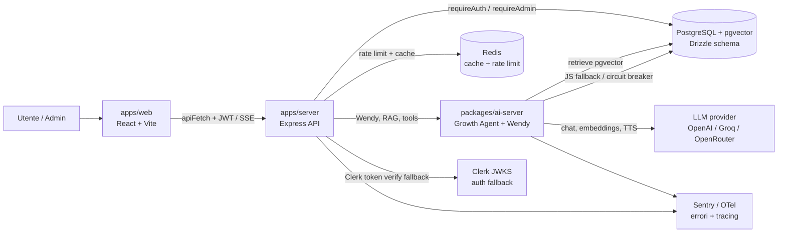

# NorthStar — Architettura e Pattern

Guida di riferimento per sviluppatori. Ogni nuovo file deve seguire i pattern descritti qui.

Per la mappa fisica del monorepo e le regole di posizionamento dei file, vedi
[`docs/REPOSITORY_STRUCTURE.md`](./docs/REPOSITORY_STRUCTURE.md).

---

## System Overview (C4 livello 2)



### Flusso request principale

1. Il frontend Vite usa `apiFetch` per inviare JWT e normalizzare 401.
2. `apps/server` valida JWT NorthStar; se fallisce, prova fallback Clerk via JWKS e risolve `clerkId` su DB.
3. Le route server accedono a PostgreSQL via Drizzle e a Redis per cache/rate limit.
4. Le route AI/Wendy chiamano `packages/ai-server` per routing, memoria, RAG e generazione.
5. Metriche Prometheus e Sentry/OTel osservano API, RAG, fallback e failure.

### Flusso RAG

1. Fonti admin/RSS/PDF vengono indicizzate in `rag_sources` e `rag_chunks`.
2. `retrieve()` valida embedding e tenta pgvector.
3. Se pgvector fallisce, il circuit breaker/fallback JS evita un errore cieco.
4. Le metriche `rag_*` alimentano `/api/admin/wendy-metrics` e la sezione "RAG Core".
5. Se non ci sono chunk affidabili, Wendy deve dichiarare dati insufficienti invece di inventare.

### Autenticazione

- Auth primaria: JWT NorthStar emesso da `apps/server/src/routes/auth.ts`.
- Auth fallback: token Clerk verificato con JWKS e mappato su `users.clerkId`.
- Autorizzazione admin: `requireAuth` + `requireAdmin`.
- Il frontend conserva token/sessione via `AuthContext` e passa sempre da `apiFetch`.

---

## Bounded Context

| Context | Route Prefix | Service Layer | Descrizione |
| --- | --- | --- | --- |
| Core Journey | `/api/profile`, `/api/test-sessions`, `/api/roadmap`, `/api/journey-type` | `services/journey/` | Profilo utente, test orientamento, roadmap e tipo percorso |
| Knowledge | `/api/knowledge`, `/api/wiki`, `/api/admin/rag` | `services/knowledge/` | Base di conoscenza, memory graph, RAG e strumenti admin RAG |
| AI Coach | `/api/wendy`, `/api/ai/wendy`, `/api/coach` | `services/wendy/` | Wendy AI, coach, memoria, prompt e proactive insights |
| Content | `/api/news`, `/api/crescita`, `/api/trending-sectors` | `services/content/` | News, articoli crescita, cataloghi editoriali e trending |
| Social | `/api/friends`, `/api/social`, `/api/leaderboard` | `services/social/` | Amici, messaggi, social feed e gamification |
| Monetization | `/api/subscription`, `/api/affiliate`, `/api/affiliazione` | `services/monetization/` | Stripe, piani, affiliate program e referral |
| Admin | `/api/admin`, `/api/admin/rag`, `/api/ml` | `services/admin/` | Pannello admin, monitoring, cataloghi, ops e quality |
| Personal Intelligence | `/api/openhuman`, `/api/graphify` | `lib/personal-intelligence-context.ts` | Bridge server-side per memoria personale e knowledge graph progetto |

La fonte runtime dei mount point server e` `apps/server/src/route-config.ts`; la tabella generata vive in [`docs/api-routes.md`](./docs/api-routes.md).

---

## Frontend Structure

- `apps/web/src/route-config.ts` contiene le route principali React, con guard e layout dichiarativi.
- `apps/web/src/RouterFromConfig.tsx` applica lazy loading, `ProtectedRoute`, `PublicOnlyRoute`, `ErrorBoundary` e `Suspense`.
- `apps/web/src/layouts/MainLayout.tsx` contiene Navbar, MobileBottomNav, Footer e padding mobile/desktop.
- `apps/web/src/layouts/AdminLayout.tsx` e `PlainLayout.tsx` coprono superfici speciali senza navigazione pubblica.
- `apps/web/src/App.tsx` mantiene solo escape hatch esplicite: Clerk path routing, admin special routes, certificati e redirect legacy.

Per aggiungere una pagina ordinaria:

1. Aggiungi il componente in `apps/web/src/pages/`.
2. Aggiungi una voce in `apps/web/src/route-config.ts`.
3. Scegli `guard: "public" | "publicOnly" | "protected"`.
4. Scegli `layout: "default" | "admin" | "plain"`.
5. Usa `PATHS` da `apps/web/src/route-paths.ts` quando il path e` condiviso.

---

## Come aggiungere una nuova feature

1. Definisci il bounded context di appartenenza.
2. Crea service in `apps/server/src/services/<context>/`.
3. Crea repo in `apps/server/src/repos/<context>/` se la feature usa DB o storage esterno.
4. Crea route in `apps/server/src/routes/<name>.ts` come thin wrapper HTTP.
5. Aggiungi la route a `apps/server/src/route-config.ts` con auth level e descrizione.
6. Rigenera `docs/api-routes.md` con `pnpm run docs:api-routes`.
7. Crea page/component in `apps/web/src/pages/` o `components/`.
8. Aggiungi la route frontend in `apps/web/src/route-config.ts`.
9. Scrivi test unitari per il service senza DB reale.
10. Esegui `pnpm run quality:required`.

---

## Stack tecnologico effettivo

| Layer    | Tecnologia                              |
| -------- | --------------------------------------- |
| Frontend | React 18 + Vite + TypeScript            |
| Styling  | Tailwind CSS + shadcn/ui (Radix UI)     |
| Router   | wouter                                  |
| State    | React Context + TanStack Query v5       |
| Realtime | EventBus (BroadcastChannel) + WebSocket |
| Backend  | Express + Node.js + TypeScript          |
| DB       | PostgreSQL (Neon) + Drizzle ORM         |
| Cache    | Redis (ioredis)                         |
| AI       | OpenRouter / Groq / OpenAI via SSE      |

---

## Pilastro 1 — Costanti Centralizzate

**File**: `apps/web/src/lib/constants.ts`

Tutte le URL `/api/...` devono passare da `API_ENDPOINTS`. Mai stringhe letterali nelle pagine.

```typescript
// ✅ CORRETTO
import { API_ENDPOINTS, withParams } from "@/lib/constants";
const res = await apiFetch(API_ENDPOINTS.briefings.list);
const url = withParams(API_ENDPOINTS.briefings.markRead, { id: 42 });

// ❌ SBAGLIATO — stringa hardcoded
const res = await apiFetch("/api/briefings");
```

Quando aggiungi una nuova route backend, aggiungi subito la costante:

```typescript
// In API_ENDPOINTS (constants.ts):
myFeature: {
  list:   "/api/my-feature",
  detail: "/api/my-feature/:id",
  create: "/api/my-feature",
},
```

---

## Pilastro 2 — Data Fetching (React Query)

**Non** usare `fetch()` direttamente nei componenti. Usa sempre `apiFetch` (inietta JWT + gestisce 401).

```typescript
// ✅ CORRETTO
import { apiFetch } from "@/lib/api-fetch";
const res = await apiFetch(API_ENDPOINTS.auth.me);

// ❌ SBAGLIATO — bypass del JWT
const res = await fetch("/api/auth/me");
```

Query con React Query:

```typescript
const { data } = useQuery({
  queryKey: ["feature", id],
  queryFn: () =>
    apiFetch(withParams(API_ENDPOINTS.myFeature.detail, { id })).then((r) =>
      r.json(),
    ),
  staleTime: 5 * 60 * 1000, // default globale in App.tsx
  enabled: !!user,
});
```

---

## Pilastro 3 — Comunicazione inter-pagina (Observer)

**File**: `apps/web/src/hooks/usePageBus.ts`, `usePageModule.ts`

Ogni pagina si registra nel sistema di messaging globale tramite `usePageModule`.

```typescript
// Ogni pagina (template obbligatorio):
export default function MyPage() {
  usePageModule({ pageId: "my-page" });
  // ...
}

// Comunicazione da una pagina all'altra:
const { bus } = usePageModule({ pageId: "dashboard" });
bus.emit("page:message", { to: "wendy-chat", body: "apri modale" });

// Ricezione messaggi:
usePageModule({
  pageId: "wendy-chat",
  onMessage: (e) => console.log("ricevuto:", e.payload),
});
```

**`usePageBus`** è il livello basso — usa `usePageModule` nelle pagine.

---

## Pilastro 4 — Error Handling

**Lato server**: `ExecutionMonitor` in `apps/server/src/lib/execution-monitor.ts`

```typescript
import { captureError } from "../lib/execution-monitor";

try {
  await riskyOperation();
} catch (err) {
  captureError(err, { file: "routes/my-route.ts", function: "POST /api/my" });
  throw err; // re-throw per Express error handler
}
```

Report disponibile in: `GET /api/admin/error-report` (richiede `x-admin-key`).

**Lato client**: `ErrorBoundary` in `apps/web/src/components/ErrorBoundary.tsx`

```tsx
// In App.tsx (già in uso):
<ErrorBoundary>
  <Suspense fallback={<PageLoader />}>
    <MyPage />
  </Suspense>
</ErrorBoundary>
```

---

## Pilastro 5 — Dead Code Analysis

Rileva file/export non usati prima di ogni release:

```bash
pnpm audit:dead-code          # report compatto (stdout)
pnpm audit:dead-code:detail   # report dettagliato
```

Config in `knip.json` (root). Output è solo report — nessun delete automatico.

---

## Pilastro 6 — Design Pattern Espliciti

I pattern OOP sono documentati con `@pattern` nei file chiave:

| Pattern                                     | File                               | Uso                                                 |
| ------------------------------------------- | ---------------------------------- | --------------------------------------------------- |
| **Singleton + Observer + BroadcastChannel** | `lib/event-bus.ts`                 | Cross-tab sync, messaging inter-pagina              |
| **Factory + Registry**                      | `growth-agent/specialist-agent.ts` | Creazione/lookup agenti AI per dominio              |
| **Template Method**                         | `components/ErrorBoundary.tsx`     | Lifecycle React (getDerivedStateFromError → render) |
| **Singleton + Ring Buffer**                 | `lib/execution-monitor.ts`         | Aggregazione errori server                          |
| **Observer + cleanup**                      | `hooks/usePageBus.ts`              | Sottoscrizione con unsubscribe automatico           |

---

## Struttura directory `apps/web/src/`

```
lib/
  constants.ts       ← API_ENDPOINTS, ROUTES, withParams()
  event-bus.ts       ← Singleton EventBus (Observer)
  api-fetch.ts       ← fetch wrapper con JWT auto-inject
  storage-keys.ts    ← chiavi localStorage costanti
  error-codes.ts     ← codici errore strutturati

hooks/
  usePageBus.ts      ← Observer wrapper (livello basso)
  usePageModule.ts   ← Lifecycle + messaging inter-pagina
  useSubscription.ts ← Piano abbonamento corrente
  useProactiveInsights.ts ← Insight proattivi Wendy

contexts/
  AuthContext.tsx     ← Auth global (login/logout/user)
  WendyProvider.tsx   ← Stato Wendy AI (open/close/ask)
  AppStateContext.tsx ← State cross-pagina (profilo, notifiche)

components/ui/
  UpgradeGate.tsx     ← Gate feature per piano (free/pro/team)
  ...shadcn/          ← Componenti Radix/shadcn (non modificare)

components/subscription/
  SubscriptionStatus.tsx ← Chip/Card/Banner piano corrente
```

---

## Checklist per nuove pagine

Prima di fare merge di una nuova pagina:

- [ ] Importa `usePageModule` e chiama `usePageModule({ pageId: "nome-pagina" })` all'inizio del componente
- [ ] Tutte le URL API passano da `API_ENDPOINTS` (nessuna stringa `/api/...` letterale)
- [ ] Usa `apiFetch` (non `fetch()` nudo) per tutte le chiamate che richiedono auth
- [ ] Usa `useQuery`/`useMutation` da React Query (non `useState` + `useEffect` per fetch)
- [ ] Lazy import in `App.tsx`: `const MyPage = lazy(() => import("@/pages/my-page"))`
- [ ] `tsc --noEmit` passa senza errori (`pnpm typecheck`)
- [ ] Nessun `any` esplicito introdotto

---

## Convenzioni di naming

| Tipo          | Convention                        | Esempio                    |
| ------------- | --------------------------------- | -------------------------- |
| Pagine        | `kebab-case.tsx`                  | `admin-rag.tsx`            |
| Componenti    | `PascalCase.tsx`                  | `ProactiveInsightCard.tsx` |
| Hook          | `camelCase.ts` con prefisso `use` | `usePageModule.ts`         |
| Costanti      | `UPPER_SNAKE_CASE`                | `API_ENDPOINTS`, `ROUTES`  |
| Route backend | `kebab-case.ts`                   | `rag-admin.ts`             |
| Schema DB     | `camelCase.ts` con suffix `Table` | `ragChunksTable`           |
