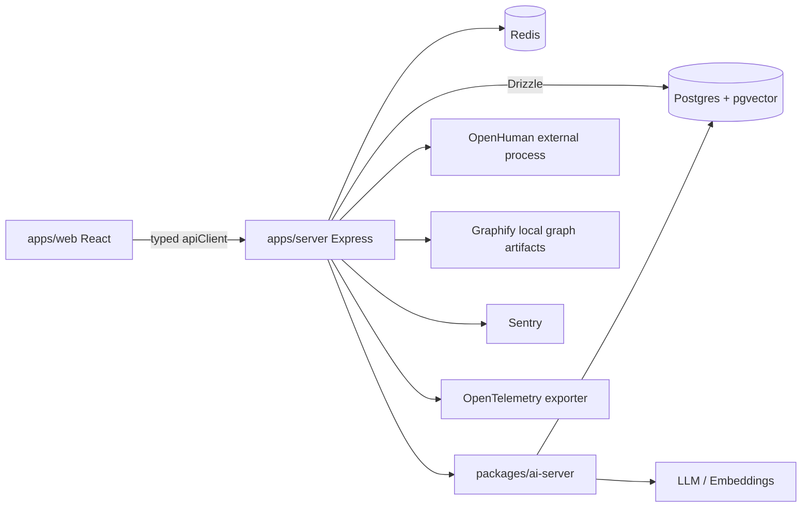

# NorthStar System Map

Updated: 2026-05-22

## Runtime Flow

## Core Boundaries

- Web owns product UI, route-level shells, feature folders and typed API calls.
- Server owns auth, route registration, policy enforcement, health readiness and external process adapters.
- AI server owns Wendy/RAG retrieval, embeddings, memory and AI fallbacks.
- Database access is typed through Drizzle and guarded by DB type audits.
- OpenHuman remains an external process; NorthStar only talks to it server-side.
- Graphify is consumed as local generated artifacts, not as runtime code copied into NorthStar.

## Quality Architecture

- `quality:required` is the daily correctness contract.
- `quality:full` is the runtime/release contract.
- `audit:file-size` currently runs as a ratchet and becomes absolute when offenders reach zero.
- Generated API code is treated as generated output and is not a manual refactor target.

## Graphify Policy

The existing graph output is useful for exploration but should be regenerated with a NorthStar-focused scope before being used as an architecture signal:

- include `apps/`, `packages/ai-server`, `packages/db`, API specs and main docs;
- exclude generated clients, test fixtures, cache/build output and unrelated external tool corpora;
- publish the resulting summary as a reviewed architecture artifact.

